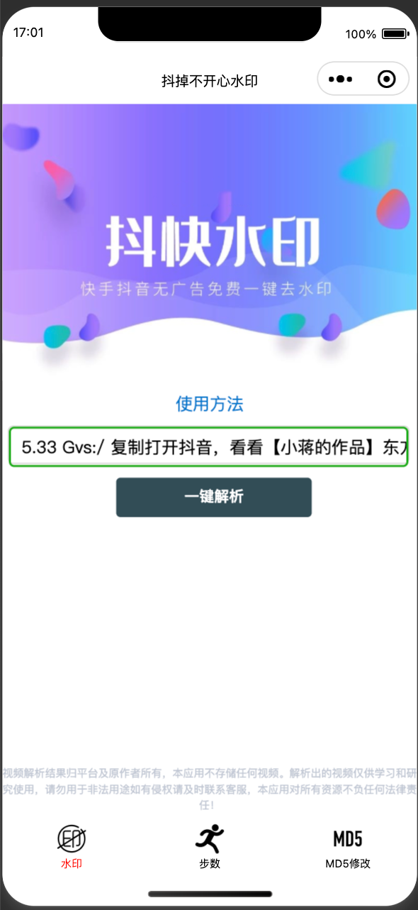
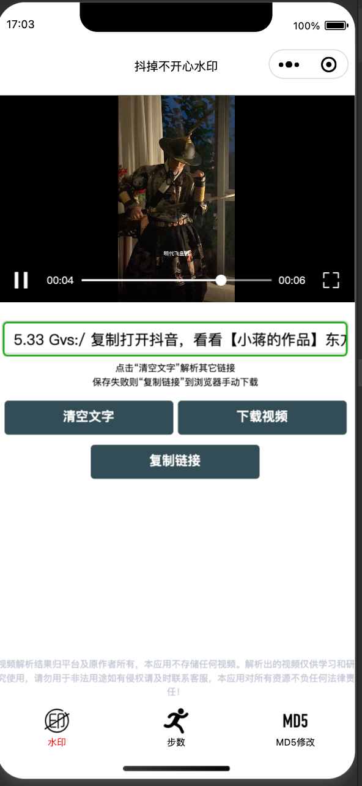
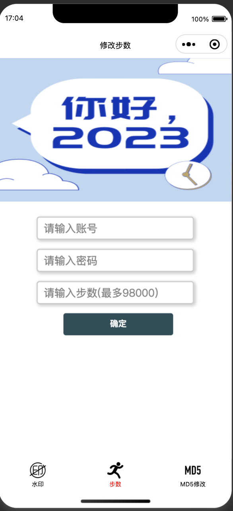

解析抖音视频及小米运动刷步数小程序

## 使用方法

1、使用`微信开发者工具`导入此项目即可运行

2、设置微信域名

登录小程序管理：<https://mp.weixin.qq.com/>

在 `开发管理->开发设置 服务器域名` 中

设置request合法域名：`https://api.oddfar.com`

> download合法域名的问题

因为抖音视频下载需要配置`downloadFile合法域名`，但最多可配置200个，抖音视频域名不止200

解放方案：**用自己服务器作为中转站**，这样只需要添加自己的域名为合法域名

```php
function download_file($url)
{
    set_time_limit(0);
    ini_set("memory_limit", "-1");
    ob_end_clean();

    header('Content-Type: application/force-download;');
    header("Content-Type: video/mp4");
    header('Content-Disposition: attachment; filename="' . date('YmdHis') . '.mp4"');

    if ($url) {
        $arr = get_headers($url, true);
        header("content-length:" . $arr["Content-Length"]);
        readfile($url);
    }
}
```

参考资料：<https://blog.csdn.net/hbqjzx/article/details/122991829>


## 接口源码

解析抖音：<https://github.com/5ime/Video_spider>

小米运动刷步数：<https://github.com/oddfar/mimotion>

## 演示图

| 演示图                                                       |                                                              |                                                              |
| ------------------------------------------------------------ | ------------------------------------------------------------ | ------------------------------------------------------------ |
|  |  |  |


